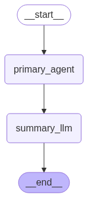

<h1 align="center">
  Agentic-LLM Test with Multiple Tools
</h1>

  <strong>Project Requirements</strong>

  <strong>Requested objectives:</strong> 
  Build a small backend app that takes user input (a natural language command) and routes it to the correct "tool" for processing. The app should return a structured response with the result of that tool's execution.

  This challenge simulates the core of an AI agent architecture in a simplified, accessible way. You are not required to use LangChain or LangGraph, but using them is a bonus and will be viewed favorably.

  <strong>The task</strong>:
  - Accepts a user query via a Post request.
  - Routes the query to one of the following tools:
    1. Weather Tool – Fetches one of the easiest weather app api (e.g., https://openweathermap.org/api)
    2. Math Tool – Performs a basic math operation (e.g, "42 * 7").
    3. LLM Tool – Answers general or open-ended questions using a language model API such as OpenAI, Perplexity, or any foundation model
  - Returns a structured JSON response that includes:
    1. The original query
    2. The tool used
    3. The result of the tool execution

  <strong>Requirements</strong>:
  - For weather tool:
    {
      "query": "What’s the weather today?",

      "tool_used": "weather",

      "result": "It's sunny and 24°C in San Francisco."
    }
  - For math operation tool:
    {
      "query": "What is 42 * 7?"

      "tool_used": " math ",

      "result": "294"
    }
  - For general question tool:
    {
      "query": " Who is the president of France?"

      "tool_used": " llm ",

      "result": " The president of France is Emmanuel Macron."
    }
  
  <strong> Bonus Point:</strong>
  - Add a WebSocket or streaming endpoint
  - Containerize the app with Docker

  <strong>My Method to Solve The Problem</strong>

    <strong>Completed task:</strong>
      - Accepts a user query via a Post request. ✅
      - Routes the query to one of the following tools:
        1. Weather Tool = For this tool i'm using the web scrapping method from https://wttr.in/ website (in my code the tool is "get_weather"). ✅
        2. Math Tool = For this tool i'm using the addition, substraction, multiplication, division, power, and modulo (in my code the tool is "math_operation"). ✅
        3. LLM Tool = For this tool i'm using the openai model "gpt-4.1-mini" model (in my code the tool is "general_question"). ✅
      - Returns a structured JSON response that includes:
        1. The original query ✅
        2. The tool used ✅
        3. The result of the tool execution ✅
    
   <strong>Additional step:</strong>
      - Perform the agentic LLM using Langchain and Langgraph ✅ 
      - Containerization with docker container ✅
      - Using FastAPI for API building ✅

## A quick explanation

## Langgraph Flow
- The user gives a question as an input into the langgraph.
- The question is processed into the primary agent.
- The primary agent is binded with the three tools mentioned before such as "get_weather", "math_operation" and "general_question" tool.
- The primary agent is mapping the question into the correct tools. After that the primary agent executing the tools to be processed in the summary agent
- The summary agent is not binded with tools and its task is to process the tool execution data and make a high level summary / rephrasing the data into the acceptable answer for easy understanding.

## How to run:

Github:
- Open terminal in current project directory
- Run git init
- Run git remote add origin "https://github.com/SvenNoir/langchain_agent.git"
- Run 'git checkout -b master' if you are not in master branch
- Run "git pull origin master"

or you can simply cloning the repository:
- Run 'git clone "https://github.com/SvenNoir/langchain_agent.git"'
- Run 'git checkout -b master' if you are not in master branch
- Run "git pull origin master"

Python environment:
1. Install python
2. Open terminal
3. Run "python3 -m venv env" to create a virtual environment
4. Run "source env/bin/activate" to activate the virtual environment
5. Run "pip install -r requirements.txt"
6. Paste the ".env" file given to you or create your own ".env" file.
6. Run "python main.py"

If you want to run the containerized version:
1. Install docker
2. Open terminal in the current project directory
3. Make sure the ".env" file is available in the current project directory.
4. Run "docker compose up -d --build"
5. Try to run "curl http://localhost:8000", if its returning "{"app_name":"Agentic test","app_version":"1.0.1"}" then the app is ready for POST requests.

The output example:

<strong>get_weather</strong>
{
    "query": "I want to go to Bekasi right now, what is the weather condition in that place right now?"
}
{
    "query": "I want to go to Bekasi right now, what is the weather condition in that place right now?",
    "tool_used": "get_weather",
    "result": "The current weather in Bekasi is partly cloudy with a temperature of around 28°C, feeling like 32°C."
}

<strong>math_operation</strong>
{
    "query": "What is five point 3 times 8?"
}
{
    "query": "What is five point 3 times 8?",
    "tool_used": "math_operation",
    "result": "The result of multiplying 5.3 by 8 is 42.4."
}

<strong>general_question</strong>
{
    "query": "Do you know who is the president of the Indonesia?"
}
{
    "query": "Do you know who is the president of the Indonesia?",
    "tool_used": "general_question",
    "result": "As of June 2024, the president of Indonesia is Joko Widodo. He has been serving since 2014 and is recognized for his focus on infrastructure development and economic reforms."
}

<strong>Contact me for the Postman collection API</strong>